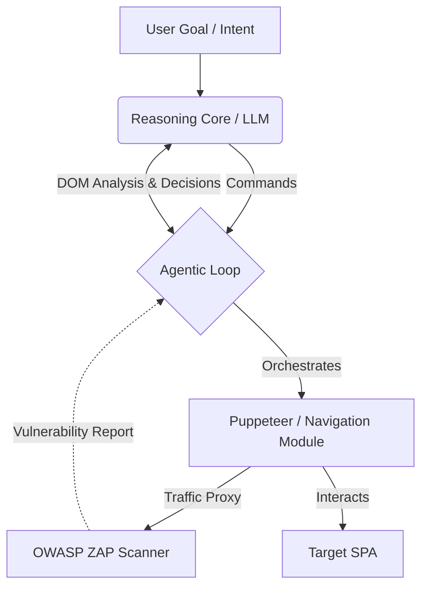

# Agentic DAST: Autonomous Security Testing for SPAs

## 📖 Overview

**Agentic DAST** is an open-source research initiative aimed at solving the "navigation gap" in Dynamic Application Security Testing (DAST) for modern Single Page Applications (SPAs).

> **The Problem:** Traditional security scanners often fail to crawl deep application states (like authenticated checkout flows) in JavaScript-heavy apps.

This framework solves this by using an **LLM-driven agent** to orchestrate a headless browser (Puppeteer). Instead of random crawling, the agent uses the *Screenplay Pattern* to navigate semantically and reach critical business logic.

---

## 🎯 Key Features (Research Goals)

| Feature | Description |
| :--- | :--- |
| **🧠 Semantic Navigation** | The agent parses the DOM to understand user intent (e.g., *"Find the checkout button"*) rather than relying on brittle CSS selectors. |
| **💉 Context-Aware Fuzzing** | Utilizes LLMs to analyze API schemas and generate valid, context-specific malicious payloads to test for **Logic Flaws** and **IDOR**. |
| **🩹 Self-Healing Tests** | Automatically recovers from UI changes by re-evaluating the page structure during execution. |

---

## 🏗️ Architecture

The project leverages a hybrid approach:

1.  **Navigation Module:** Puppeteer (Node.js) controlled by an Agentic Loop.
2.  **Security Scanner:** [OWASP ZAP](https://www.zaproxy.org/) (running in Daemon mode) proxied behind the browser to capture and analyze traffic.
3.  **Reasoning Core:** Large Language Models (OpenAI GPT-4 / Local Models) for decision making and payload generation.

## 🗺️ Roadmap

- [ ] **Literature Review & Architecture Design** (Current Phase)
- [ ] **Prototype:** Basic Semantic Navigation with Puppeteer
- [ ] **Integration:** Puppeteer + OWASP ZAP Proxy
- [ ] **Implementation:** LLM-based Payload Generation
- [ ] **Evaluation:** Benchmark against OWASP Juice Shop

---

## 🎓 Academic Context

> This project is being developed as an undergraduate thesis (**Capstone Project**) in Computer Engineering.

The goal is to produce empirical evidence on the efficacy of LLM-agents in uncovering business logic vulnerabilities compared to traditional DAST scanners.
